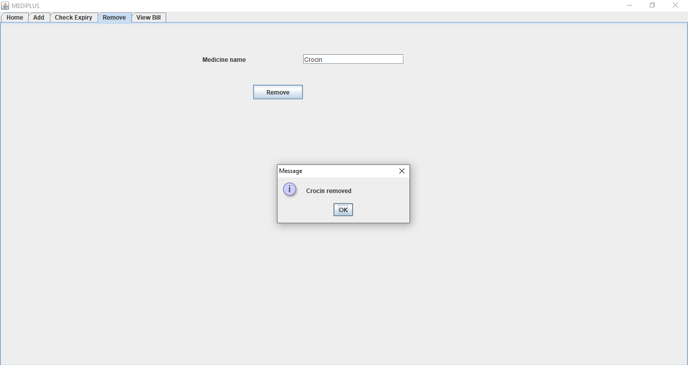

# Pharmacy Management system

The pharmacy management system is developed using Java Swing GUI. The system provides the following functions.

- Bill Generation
- Addition of new medicines
- Checking expiry of medicines
- Removal of banned/non-profit medicines
- History of purchase

# Output Images

1. Bill Generation 
   

1. Add Medicine 
   

1. Check Expiry 
   

1. Remove Medicine 
   

1. History of purchase 
   
